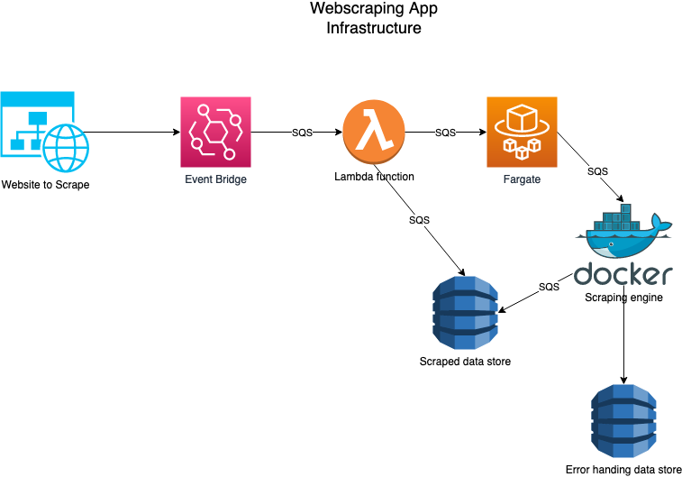

# Basic webscraping validation

This project was built as a part of a interview question that peaked my interest. I decided to build infrastructure and a process to test the variance of basic websites (Reddit in this case) looking at HTML tag variation and trying to understand the basic framework of the website to determine if there is a change to the website that may affect any webscraping code written. 

The basic design is around serverless architecture (AWS Fargate in this case, as that was the architecture the role was looking for). Using decoupled services to scrape and store data with AWS serverless services and managed services, using SQS to decouple infrastructure. 

## Infrastructure diagram

## Current status 
This app is in current active development.